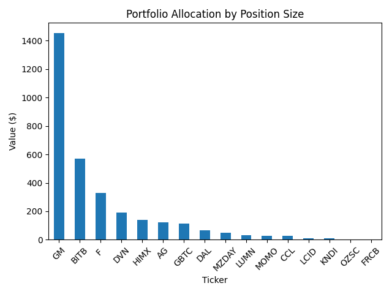

# 📊 Portfolio Analytics & Strategy Evaluation

Data-driven analysis of an investment portfolio to evaluate performance, strategy effectiveness, and risk management decisions.

---

## 🧠 What It Does

This project analyzes a real investment portfolio using Python to assess returns, identify weaknesses, and evaluate the impact of strategy and allocation decisions.

---

## 🧠 Overview

The analysis focuses on understanding how different investment strategies contribute to overall portfolio performance.

Key areas explored include:

- Strategy-level performance (long-term vs speculative trades)  
- Portfolio concentration and allocation risk  
- Impact of downside losses on total returns  
- Scenario-based improvements through risk controls  

This project demonstrates how data analysis can uncover hidden performance drivers and improve decision-making.

## 📊 Key Visualization

*Portfolio allocation by position size, highlighting concentration risk and capital distribution across holdings.*
---

## ✨ Features

- 📊 Portfolio return calculations (total, weighted, and strategy-based)  
- 🧠 Strategy comparison (long-term vs speculative trades)  
- ⚖️ Portfolio concentration analysis  
- ⚠️ Risk simulations:
  - Removing speculative trades  
  - Capping downside losses  
- 📈 Data visualization of performance and allocation  

---

## 📈 Key Results

- Total Portfolio Value: $3,137  
- Total Profit: $146  
- Overall Return: ~4.9%  
- Long Strategy Return: ~28.9%  
- Speculative trades significantly underperformed  
- Portfolio heavily concentrated in GM (~46%)  

---

## 🛠 Tech Stack

- Python  
- Pandas  
- yfinance  
- Matplotlib  

---

## 📊 Example Analysis

- Strategy performance comparison  
- Portfolio allocation breakdown  
- Risk-adjusted performance scenarios  

---

## 💡 Key Insight

A strong investment strategy alone is not enough — portfolio performance is heavily influenced by allocation decisions and risk management.

Data-driven analysis reveals where performance is gained — and where it is lost.

---

## 🚀 Future Improvements

- Portfolio optimization models  
- Machine learning for return prediction  
- Interactive dashboard for portfolio tracking  

---

## 💡 Vision

This project demonstrates how financial data can be used to evaluate and improve investment decision-making.

It serves as a foundation for building more advanced portfolio analytics tools and data-driven investment systems.
